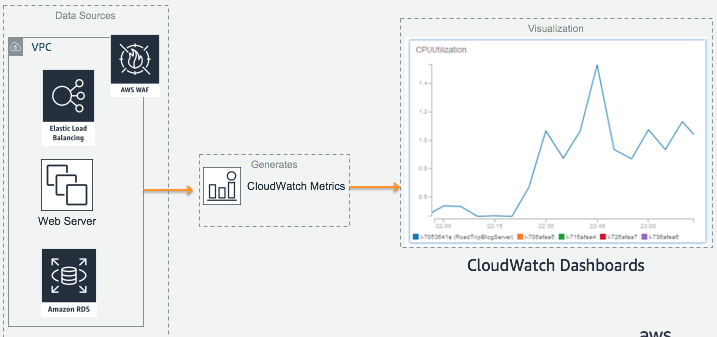
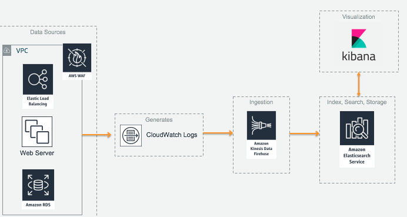
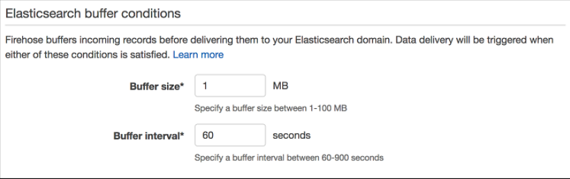

# Module 1:

1. Launch CloudFormation template (2 tier wordpress on EC2 and RDS)
1. Set up CloudWatch Agent for memory and Disk
1. CloudWatch Dashboard

1. CloudWatch Logs and ElasticSearch
1. Health Dashboard on ES (CPU/Memory/DiskQueueLength/DatabaseConnections/FreeStorageSpace)

## Introduction
In the first part of this module, we will create a monitoring dashboard to gain visibility into the operational health of our infrastructure for EC2 and RDS instance. By surfacing these metrics, we can detect potential problems earlier on to spot capacity failures, and gain insights on demand pattern for time series analysis and cost savings through elasticity.


In the second part of this module, we will use AWS WAF to log incoming HTTP requests and use a ruleset to observe Blocked and Allowed requests in Kibana and Elasticsearch. 

For our working environment, we will use a 2-tier Wordpress Site running on EC2 and Amazon RDS for MySQL DB. Scroll down to get started!

## Architecture
#### Monitoring Infrastructure through CloudWatch Metrics and Dashboards

#### Monitoring web requests through AWS WAF


# Creating our Wordpress Environment
CloudFormation instructions

# Monitoring Infrastructure through CloudWatch Metrics and Dashboards
Comment about EC2 and RDS, and why cloudwatch agent required

## Setting up CloudWatch Agent
We do this because there are metrics for EC2 instance that are not visible at the hypervisor level such as Memory and Disk free space. If we were to run in an hybrid environment, we can use CloudWatch Agent for on-premises servers as well.

<details>
<summary><strong>Setting up CloudWatch Agent on EC2 Step-By-Step Instructions (expand for details)</strong></summary><p>

</p></details>


## CloudWatch Dashboard
Create a Dashboard through CloudWatch as it has integration with our Metrics. If we wanted to run our CloudWatch Dashboard outside of AWS Console, here is a [blog article](https://aws.amazon.com/blogs/devops/building-an-amazon-cloudwatch-dashboard-outside-of-the-aws-management-console/)

<details>
<summary><strong>Creating a new CloudWatch Dashboard Step-By-Step Instructions (expand for details)</strong></summary><p>

</p></details>


# Monitoring Web Requests through AWS WAF
[AWS WAF](https://aws.amazon.com/waf/) is a web application firewall that helps protect your web applications from common web exploits that could affect application availability, compromise security, or consume excessive resources. 

Using CloudWatch logs, we can publish additional type of data such as Windows event logs to CloudWatch for downstream processing or alerts. These are essential for day-to-day troubleshooting but also a long term understanding of how our infrastructure is performing. 

To help protect our web application, we can leverage AWS WAF to implement a Layer 7 firewall to protect against web exploits such as Cross Site Scripting or SQL Injection attacks. In this module, we will be creating a new rule that blocks a certain IP address to simulate an enforced rule and see it amongst other successful HTTP requests in Kibana.


<details>
<summary><strong>Creating a new AWS WAF Step-By-Step Instructions (expand for details)</strong></summary><p>

</p></details>

## Storing, Indexing and Searching Data with an Amazon Elasticsearch cluster
With data being generated from multiple different sources, we need a way to search, analyze and visualize it to extract meaningful information and insights. To enable this, we can use Amazon Elasticsearch, a fully managed service that helps with the deployment, operations and scaling the open source Elasticsearch engine. Using the integrated Kibana tool, we can create custom visualizations and dashboards to enable us to make faster and more informed decisions about our environment!

<details>
<summary><strong>Creating an Elasticsearch Step-By-Step Instructions (expand for details)</strong></summary><p>

1. In the AWS Management Console select **Services** then select **Elasticsearch Service** under Analytics.

1. In the service console, select **Create a new domain**

1. Under **Domain Name** enter a name for your cluster and ensure that the selected **Version** is **6.3**. Proceed to the **Next** step.

1. In this page, we can configure the number of nodes and HA settings for our Elasticsearch cluster. We will use the default single node setting, but for production environments, you would use multiple nodes across different availability zones using the **zone awareness** setting. Continue by leaving all settings as-is under **Configure cluster** and proceed to the **Next** step. 

1. In step 3: Set up access page, you can configure Network level access and Kibana login authentication through integration with Amazon Cognito (SAML with existing IdP is supported through Cognito). In production environments, you would launch the Elasticsearch cluster in a private subnet (where it is accessible via VPN or a proxy in a DMZ). However for this workshop, we will use **Public Access** to allow access to the Kibana dashboard over the internet.

1. Select **Public access** under **Network configuration** and leave the **Node-to-node** encryption unchecked.

1. Leave **Enable Amazon Cognito for authentication** unticked under **Kibana authentication**.

1. Under **Access policy**, use the drop down menu on **Select a template**, and select **Allow access to the domain from specific IP(s)**.

1. Enter your current IP address in the pop up window (you can find out your current public address by googling "Whats my IP"). This should automatically generate an access policy in JSON like below, where my public IP address is 54.240.193.1.

    ```json
        {
        	"Version": "2012-10-17",
        	"Statement": [{
        		"Effect": "Allow",
        		"Principal": {
        			"AWS": "*"
        		},
        		"Action": [
        			"es:*"
        		],
        		"Condition": {
        			"IpAddress": {
        				"aws:SourceIp": [
        					"54.240.193.1"
        				]
        			}
        		},
        		"Resource": "arn:aws:es:ap-southeast-1:708252083442:domain/realtimeworkshop/*"
        	}]
        }
    ```
1. Proceed to the next page by selecting **Next**.

1. Review that all the settings are correct using the above configurations and create the cluster by selecting **Confirm**. The cluster will take 10-15 min to launch.

1. Once your environment is ready, you'll be able to see the **Domain Status** change to `Active` with the link to your Kibana dashboard.

1. Access your Kibana environment using the link on your ES domain, as you will need to configure an index pattern template. While Elasticsearch can automatically classify most of the fields from the AWS WAF logs, you need to inform Elasticsearch how to interpret fields that have specific formatting. Therefore, before you start sending logs to Elasticsearch, you should create an index pattern template so Elasticsearch can distinguish AWS WAF logs and classify the fields correctly.

1. With your Kibana environment, use the **Dev Tools** tab in the left panel menu to apply a new template.

1. Change the first line of the template following PUT  _template/, with the name of your ES domain. For example, if we named our ES domain `myLabES`, we would use the following template.

	```JSON
	PUT  _template/myLabES
	{
		"index_patterns": ["awswaf"],
		"settings": {
		"number_of_shards": 1
		},
		"mappings": {
		"waflog": {
			"properties": {
			"httpRequest": {
				"properties": {
				"clientIp": {
					"type": "keyword",
					"fields": {
					"keyword": {
						"type": "ip"
					}
					}
				}
				}
			},
			"timestamp": {
				"type": "date",
				"format": "epoch_millis"
			}
		}
		}
	}
	}
	```
	* To break down the sections of the applied template, this sends an API call to our Elasticsearch domain as identified by `PUT  _template/myLabES` with the following JSON configuration.
	
	* It identifies the index we've used to be `awswaf`, and uses a single Elasticsearch shard for the index. For a deep dive on sizing your Shards, please see [this blog](https://aws.amazon.com/blogs/database/get-started-with-amazon-elasticsearch-service-how-many-shards-do-i-need/).

	* The pattern template is defining two fields from the logs. It will indicate to Elasticsearch that the httpRequest.clientIp field is using an IP address format and that the timestamp field is represented in epoch time. All the other log fields will be classified automatically.

1. Congratulations, you've configured your Elasticsearch domain for our workshop modules.

</p></details>

## Ingesting Streaming Data with Kinesis Firehose
To ingest the streaming log data from our WAF, we can use [Amazon Kinesis Firehose](https://aws.amazon.com/kinesis/data-firehose/) to automatically ingest and deliver data into our Elasticsearch domain as the destination. We will be using the native integration for web ACL logging with Firehose as [prescribed here](https://docs.aws.amazon.com/waf/latest/developerguide/logging.html).


<details>
<summary><strong>Creating a Kinesis Firehose to Elasticsearch Step-By-Step Instructions (expand for details)</strong></summary><p>

1. In the AWS Management Console select **Services** then select **Kinesis** under Analytics.

1. In the service console, select **Get Started** and select **Create delivery stream** for the Kinesis Firehose wizard.

1. Under **New delivery stream**, give your Delivery stream a name that begins with `aws-waf-logs-` e.g. `aws-waf-logs-lab`. This is required as WAF integration requires this specific naming prefix.

1. Under **Choose source**, verify that **Direct PUT or other sources** is selected. 

1. Proceed to the next page by selecting **Next**.

1. In Step 2: Process records, leave **Record transformation** to **Disabled**.

1. Verify that Record format conversion is **Disabled** under **Convert record format**. If we wanted to deliver the data within Firehose for running analytics within Redshift or S3 (via Athena), this would be a great way to automatically transform the data into a columnar format such as Parquet for a more efficient file format for analytics.

1. Proceed to the next page by selecting **Next**.

1. Under **Select destination**, select **Amazon Elasticsearch Service** to view our existing domain.

1. Under **Amazon Elasticsearch Service destination**, select our existing cluster for **Domain**.

1. For **Index**, use `awswaf` as the index name. To match the index pattern template we applied in Kibana earlier.

1. Select **No rotation** for index rotation frequency and use `waflog` as the name for **Type**. 

	# INSERT PICTURE

1. Under **S3 backup**, we can select whether a copy of the records from our Firehose is automatically backed up into an S3 bucket, or only for records that fails to be processed. For this workshop, select **All records** to view the data later on to have a look at the ingested data.

1. Create or use an existing S3 bucket and for **Backup S3 bucket prefix**, enter a name followed by underscore such as `waf_`. This will make it easier later on to identify which prefix our firehose backups the records into.

1. Your settings should look similar to this

	# INSERT PICTURE

1. Proceed to the next page by selecting **Next**.

1. In Step 4: Configure Settings, select a **Buffer size** of 1 MB and **Buffer interval** of 60 seconds. As Firehose automatically buffers and aggregates the data in the stream, it will wait until either of these conditions are met before triggering the delivery. If you need to ensure faster (lower) availability of data in the stream, Kinesis Data Stream allows a more immediate window.

	

1. For **S3 compression and encryption** check that the settings are set to **Disabled**, and for **Error logging**, ensure that it is **Enabled** for future troubleshooting if required.

1. Under **IAM Role**, select **Create new or choose** to bring up a new IAM role creation page. Under IAM Role, use the drop down menu to select **Create a new IAM Role**. This will automatically generate the permissions required for our Firehose to use the configured settings for CloudWatch, S3, Lambda and ElasticSearch.

    

1. Proceed to the next step by selecting **Allow**.

1. Verify that the settings are configured as above, and finish the wizard by selecting **Create delivery stream**. This will take 3-5 min to complete creating the new stream.

</p></details>

# Visualizing Log Data with Kibana
Now that we WAF logs


## [Optional] RDS Logs to Elasticsearch
With Enhanced Monitoring enabled for Amazon RDS instance, the service publishes metrics for your DB instance to CloudWatch Logs. As this has been already enabled for your RDS environment via CloudFormation, try to find `RDSOSMetrics` in your CloudWatch Log Group and stream it into your Elasticsearch as an additional data source. For configuring Log Format, you should use **JSON** for compatibility with ES.