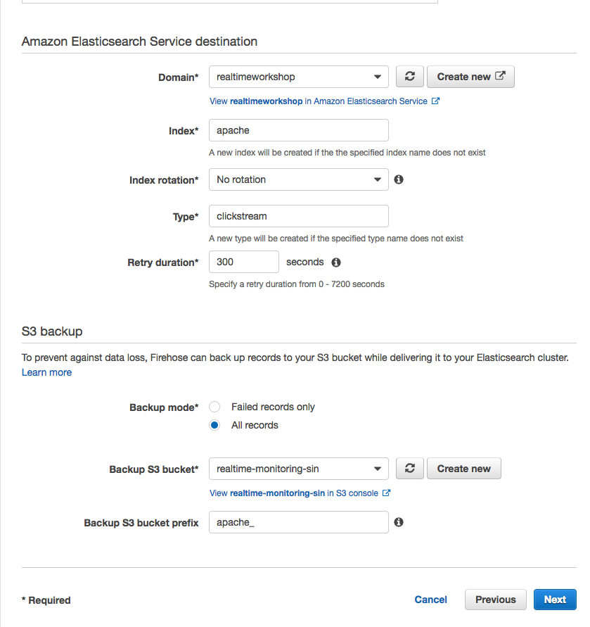
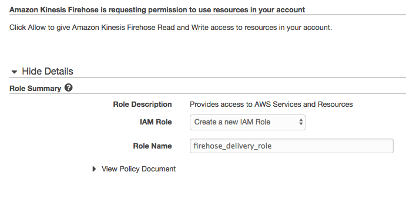
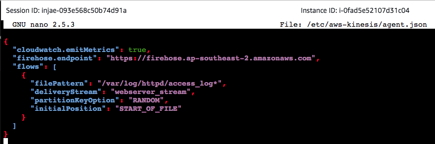
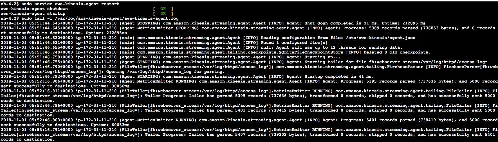

# Module 2

1. Wordpress Site
1. Generate clickstream logs on WP (timestamp, page viewed, username) with script
1. Setting up Kinesis-Agent
1. Firehose w/ Transformation Lambda for ETL
1. Publish to ElasticSearch
1. Verify on Kibana (500 requests vs 200 requests, page views, sign up, sign in, usernames)


# instructions

## Create an Amazon Elasticsearch cluster
With data being generated from multiple different sources, we need a way to search, analyze and visualize it to extract meaningful information and insights. To enable this, we can use Amazon Elasticsearch, a fully managed service that helps with the deployment, operations and scaling the open source Elasticsearch engine. Using the integrated Kibana tool, we can create custom visualizations and dashboards to enable us to make faster and more informed decisions about our environment!

1. In the AWS Management Console select **Services** then select **Elasticsearch Service** under Analytics.

1. In the service console, select **Create a new domain**

1. Under **Domain Name** enter a name for your cluster and ensure that the selected **Version** is **6.3**. Proceed to the **Next** step.

1. In this page, we can configure the number of nodes and HA settings for our Elasticsearch cluster. We will use the default single node setting, but for production environments, you would use multiple nodes across different availability zones using the **zone awareness** setting. Continue by leaving all settings as-is under **Configure cluster** and proceed to the **Next** step. 

1. In step 3: Set up access page, you can configure Network level access and Kibana login authentication through integration with Amazon Cognito (SAML with existing IdP is supported through Cognito). In production environments, you would launch the Elasticsearch cluster in a private subnet (where it is accessible via VPN or a proxy in a DMZ). However for this workshop, we will use **Public Access** to allow access to the Kibana dashboard over the internet.

1. Select **Public access** under **Network configuration** and leave the **Node-to-node** encryption unchecked.

1. Leave **Enable Amazon Cognito for authentication** unticked under **Kibana authentication**.

1. Under **Access policy**, use the drop down menu on **Select a template**, and select **Allow access to the domain from specific IP(s)**.

1. Enter your current IP address in the pop up window (you can find out your current public address by googling "Whats my IP"). This should automatically generate an access policy in JSON like below.

    ```json
        {
        	"Version": "2012-10-17",
        	"Statement": [{
        		"Effect": "Allow",
        		"Principal": {
        			"AWS": "*"
        		},
        		"Action": [
        			"es:*"
        		],
        		"Condition": {
        			"IpAddress": {
        				"aws:SourceIp": [
        					"54.240.193.1"
        				]
        			}
        		},
        		"Resource": "arn:aws:es:ap-southeast-1:708252083442:domain/realtimeworkshop/*"
        	}]
        }
    ```
1. Proceed to the next page by selecting **Next**.

1. Review that all the settings are correct using the above configurations and create the cluster by selecting **Confirm**. The cluster will take 10-15 min to launch.

## Create Firehose with Lambda ETL
As new visitors arrive to our website, our apache webserver captures each request in the form of clickstream logs. By capturing and ingesting these logs in real time, we can create visibility on whats happening within our application and derive insights such as seeing the breakdown of requested pages by popularity, following the trail of page paths a visitor took and troubleshooting by tracking the number of 5XX HTTP responses back to the user. By using Amazon Kinesis Data Firehose for a fully managed data ingestion service, we can apply ETL on the fly with integration with AWS Lambda to transform our clickstream logs into an Elasticsearch compatible format, and continually deliver and update our Elasticsearch indexes.

We will first create the ETL Lambda function, which we will use later in our Kinesis Data Firehose.

## Creating an ETL Lambda function

1. In the AWS Management Console select **Services** then select **Lambda** under Compute.

1. In the service console, select **Create a function**

1. In **Create function page**, select **Author from scratch**. Give your function a name such as `apache_ETL`.

1. For **Runtime**, select **Python 2.7**.

1. Under **Role**, select **Create a custom role** to bring up a new IAM role creation page. Ensure that **Create a new IAM Role** is selected and proceed to the next step by selecting **Allow**. This will automatically generate a new IAM role with just enough permissions scoped to allow our Lambda function to extract data from our Kinesis and update the Elasticsearch index.

1. Back in create function page, proceed by selecting **Create function** at the bottom of the page.

1. Scroll down to the Code editing window and you'll see some sample code like below.

    ``` python
    import json

    def lambda_handler(event, context):
    # TODO implement
    return {
        "statusCode": 200,
        "body": json.dumps('Hello from Lambda!')
    }
    ```

1. Delete and replace the sample code with the following script. Have a look at the code and the comments to see what's happening to the incoming data before it is ETL'ed and put back into the Firehose stream.

    ``` python
    from __future__ import print_function
    import base64
    import json
    import re
    from dateutil.parser import parse
    from datetime import datetime, tzinfo, timedelta

    print('Loading function')


    class UTC(tzinfo):
        """UTC"""

        def utcoffset(self, dt):
            return timedelta(0)

        def tzname(self, dt):
            return "UTC"

        def dst(self, dt):
            return timedelta(0)

    utc = UTC()


    def lambda_handler(event, context):

        print ("This is the raw event: {}".format(event))
        output = []
        succeeded_record_cnt = 0
        failed_record_cnt = 0
        
        safe_string_to_int = lambda x: int(x) if x.isdigit() else x

        ## Because data in Kinesis is base64 encoded, we have to decode it before changing the output as a JSON document
        for record in event['records']:
            print(record['recordId'])
            payload = base64.b64decode(record['data'])
            payload = payload.decode("utf-8")
            print ("This is the payload: {}".format(payload)) 
            
            # check if clickstream log format else fall back to other log format
            regex = '^([\d.]+) (\S+) (\S+) \[([\w:\/]+)(\s[\+\-]\d{4}){0,1}\] "(.+?)" (\d{3}) (\d+) (".+?") (".+?") "user = ([^;]*)' 
            p = re.compile(regex)
            m = p.match(payload)
            
            if p.match(payload) is None: # log format doesnt have cookie data (username)
                regex = '^([\d.]+) (\S+) (\S+) \[([\w:/]+)(\s[\+\-]\d{4}){0,1}\] \"(.+?)\" (\d{3}) (\d+) (".+?") (".+?")'
                p = re.compile(regex)
                m = p.match(payload)
            
            if m:
                succeeded_record_cnt += 1

                ts = m.group(4)
                ## changing the timestamp format
                try:
                    d = parse(ts.replace(':', ' ', 1))
                    ts = d.isoformat()
                except:
                    print('Parsing the timestamp to date failed.')
                ## Creating our dictionary (hash map) using extracted values from our log file
                data_field = {
                    'host': m.group(1),
                    'ident': m.group(2),
                    'authuser': m.group(3),
                    '@timestamp': ts,
                    'request': m.group(6),
                    'response': safe_string_to_int(m.group(7)),
                    'bytes': safe_string_to_int(m.group(8)),
                    'referer': safe_string_to_int(m.group(9)),
                    'user-agent': safe_string_to_int(m.group(10))
                }
                ## Clickstream log, adding username from cookie field
                if (len(m.groups()) > 10):
                    data_field['username'] = safe_string_to_int(m.group(11))
        
                if m.group(6) and len(m.group(6).split()) > 1:
                    data_field['verb'] = m.group(6).split()[0]

                # If time offset is present, add the timezone and @timestamp_utc fields
                if m.group(5):
                    data_field['timezone'] = m.group(5).strip()
                    try:
                        ts_with_offset = m.group(4) + m.group(5)
                        d = parse(ts_with_offset.replace(':', ' ', 1))
                        utc_d = d.astimezone(utc)
                        data_field['@timestamp_utc'] = utc_d.isoformat()
                    except:
                        print('Calculating UTC time failed.')

                output_record = {
                    'recordId': record['recordId'],
                    'result': 'Ok',
                    'data': base64.b64encode(json.dumps(data_field))
                }
            else:
                print('Parsing failed')
                failed_record_cnt += 1
                output_record = {
                    'recordId': record['recordId'],
                    'result': 'ProcessingFailed',
                    'data': record['data']
                }

            output.append(output_record)
        
        ## This returns the transformed data back to Kinesis Data Firehose for delivery to our Elasticsearch domain
        print('Processing completed.  Successful records {}, Failed records {}.'.format(succeeded_record_cnt, failed_record_cnt))
        print ("This is the output: {}".format(output))
        return {'records': output}

    ```
1. After putting our new code in, scroll down and find a section called **Basic settings**. Increase the timeout from 3 seconds to 1 min to allow our lambda function to process the record transformation, reducing the risk of timing out before it is complete.

1. Finish creating the function by selecting **Save** at the top of the page.


## Creating a Kinesis Firehose
Now that our ETL Lambda has been created, let's create a new Kinesis Data Firehose that will use our Elasticsearch domain as the delivery destination.

1. In the AWS Management Console select **Services** then select **Kinesis** under Analytics.

1. In the service console, select **Get started** and select **Create delivery stream** for the Kinesis Firehose wizard.

1. Under **New delivery stream**, give your Delivery stream name such as `webserver_stream`.

1. Under **Choose source**, verify that **Direct PUT or other sources** is selected. Although Kinesis Data Firehose can be configured to ingest data from a Kinesis Data stream (non-firehose), we will be using an agent to push into our Firehose stream.

1. Proceed to the next page by selecting **Next**.

1. In Step 2: Process records, enable **Record transformation** using the Lambda function we created previously (eg. apache_ETL).

1. Verify that Record format conversion is **Disabled** under **Convert record format**. If we wanted to deliver the data within Firehose for running analytics within Redshift or S3 (via Athena), this would be a great way to automatically transform the data into a columnar format such as Parquet for a more efficient file format for analytics.

    

1. Proceed to the next page by selecting **Next**.

1. Under **Select destination**, select **Amazon Elasticsearch Service** to view our existing domain.

1. Under **Amazon Elasticsearch Service destination**, select our existing cluster for **Domain**.

1. For **Index**, give a name such as `apache`.

1. Select **No rotation** for index rotation frequency and enter a name for **Type** such as `clickstream`.

1. Under **S3 backup**, we can select whether a copy of the records from our Firehose is automatically backed up into an S3 bucket, or only for records that fails to be processed. For this workshop, select **All records** to view the data later on to have a look at the ingested data.

1. Create or use an existing S3 bucket and for **Backup S3 bucket prefix**, enter a name followed by underscore such as `apache_`. This will make it easier later on to identify which prefix our firehose backups the records into.

1. Your settings should look similar to this

    


1. Proceed to the next page by selecting **Next**.

1. In Step 4: Configure Settings, select a **Buffer size** of 1 MB and B**uffer interval** of 60 seconds. As Firehose automatically buffers and aggregates the data in the stream, it will wait until either of these conditions are met before triggering the delivery. If you need to ensure faster (lower) availability of data in the stream, Kinesis Data Stream allows a more immediate window.

1. For **S3 compression and encryption** check that the settings are set to **Disabled**, and for **Error logging**, ensure that it is **Enabled** for future troubleshooting if required.

1. Under **IAM Role**, select **Create new or choose** to bring up a new IAM role creation page. Under IAM Role, use the drop down menu to select **Create a new IAM Role**. This will automatically generate the permissions required for our Firehose to use the configured settings for CloudWatch, S3, Lambda and ElasticSearch.

    

1. Proceed to the next step by selecting **Allow**.

1. Verify that the settings are configured as above, and finish the wizard by selecting **Create delivery stream**. This will take 5-7 min to complete creating the new stream.


## Install Kinesis Agent
To allow an easier way to parse, process and send the local log files in our web server into our Kinesis Firehose, we can use Kinesis Agent which is a stand-alone Java application to continually monitor a set of files for changes and push the data into the stream. 

For authentication and authorization for the Agent to interact with our Firehose stream, it requires a set of AWS Access Keys and Secret Keys with the appropriate resource permissions. For this workshop, our EC2 instance running our web server has an IAM role attached with this permission. With this, we don't need to hardcode our keys into the Kinesis Agent configuration file as it will automatically use the temporary credentials generated by the EC2's IAM role. [Click here](https://docs.aws.amazon.com/IAM/latest/UserGuide/id_roles_use_switch-role-ec2.html) to find out more about this process.

Let's go ahead and SSH into our webserver to install and configure the agent.

1. If you have an SSH client such as Putty on Windows or Terminal on Mac, use this to connect to your EC2 instance. If you don't have an SSH client, you can create a new session online through the AWS Console using the Systems Manager service.

    <details>
    <summary><strong>SSH session through Systems Manager (expand for details)</strong></summary><p>

    [Reference link](https://docs.aws.amazon.com/systems-manager/latest/userguide/session-manager-working-with-sessions-start.html)

    1. In the AWS Management Console select **Services** then select **Systems Manager** under Management Tools.

    1. In the service console, select **Session Manager** from the left hand panel and select **Start Session** to list target instances.

    1. You should be able to see our web server instance. Select the instance and open a new SSH session window by selecting **Start Session**.

    1. In the new SSH session, change to root user by entering sudo -s.
    </p></details>

1. Download and Install the [Kinesis Agent](https://docs.aws.amazon.com/streams/latest/dev/writing-with-agents.html) using the following command. As the EC2 instance has an attached IAM role, you can skip the pre-requisites referring to IAM or AWS credentials (the Agent will do this automatically) in the reference link.

    ```shell
    sudo yum install aws-kinesis-agent -y
    ```

1. Now we will configure the Kinesis Agent to use the Kinesis Firehose we created previously, and to parse the apache log file.

1. Verify if you have correct permissions to read the file by opening the file. If you see permission denied, you may have to use chmod to change the permission for the directory.

    ```shell
    cat /var/log/httpd/access_log
    ```

1. Use your favourite editor (vim, nano, pico or Emacs if you're brave!) to open and edit the configuration file `/etc/aws-kinesis/agent.json`.

    ```shell
    sudo nano /etc/aws-kinesis/agent.json
    ```

1. You can use the configuration syntax in the [Kinesis Agent documentation](https://docs.aws.amazon.com/streams/latest/dev/writing-with-agents.html#agent-config-settings) page, or use settings below. Remember to change the values to your own resource names.

    **firehose.endpoint:** Firehose regional endpoint

    **filePattern:** Path to our log file. Appending the wildcard will allow the Agent to pick up rotating log files (eg. when you accidently delete and create it again)

    **deliveryStream:** Friendly name of your Firehose (eg. webserver_stream)


    ```json
    {
        "cloudwatch.emitMetrics": true,
        "firehose.endpoint": "https://firehose.ap-southeast-2.amazonaws.com",
        "flows": [
            {
                "filePattern": "/var/log/httpd/access_log*",
                "deliveryStream": "clickstreamy",
                "partitionKeyOption": "RANDOM",
                "initialPosition": "START_OF_FILE"       
            }
        ]
    }
    ```

1. Save the file with ctrl+O (then enter), and exit by ctrl+X.

    *Example of config file*
    

1. Start the Kinesis Agent service with the following command.

    ```shell
    sudo service aws-kinesis-agent start
    aws-kinesis-agent startup                                  [  OK  ]
    ```

1. Now that the agent has started, we can observe the Agent log file to see if it picks up the apache request logs and send it to our Kinesis Firehose.

    

1. We can also observe the metrics for our Kinesis Data stream within the Monitoring section within the Kinesis console.


## Using Kibana to visualize Apache Logs
Now that our plumbing is in place, the workflow will look like this.


Web Server logs incoming HTTP requests -> Kinesis Agent parses log file and push to Kinesis Firehose -> Integrated Lambda function will ETL the log data and put the transformed data back into the stream -> Kinesis Firehose will deliver the new document into Elasticsearch and update the Index.

1. Open Kibana dashboard from ES console
1. click on links
1. see on kibana

## Testing 2
1. Generate log script
1. see on kibana
