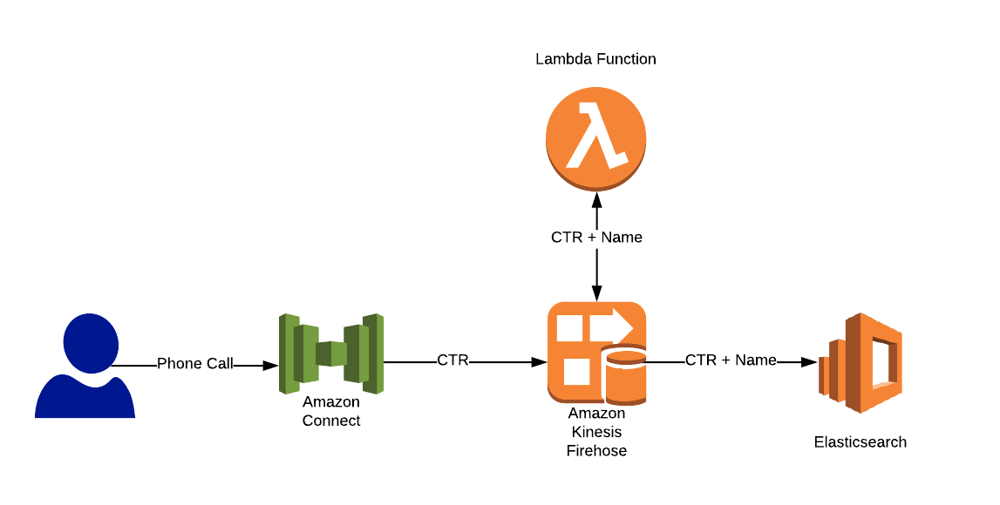

# Module 3. Stream Amazon Connect data in real time with Kinesis and Elasticsearch 

## Background
In this module, we will use Amazon's Elasticsearch service (Amazon ES) for real-time analytics of contact trace records (CTR) from an Amazon Connect contact center. A detailed list of components used in the solution are as follows:

### Amazon Connect
Amazon Connect is a self-service, cloud-based contact center service based on the same contact center technology used by Amazon customer service associates around the world to power millions of customer conversations. There are no up-front payments or long-term commitments and no infrastructure to manage with Amazon Connect; customers pay by the minute for Amazon Connect usage plus any associated telephony services.
In Amazon Connect, data about contacts, such as the amount of time a contact spends in each state (customer on hold, customer in queue, agent interaction time) are captured in contact trace records (CTR). The basis for most historical and real-time metrics in Amazon Connect is the data in the CTR.

### Amazon Kinesis Firehose
Amazon Kinesis Data Firehose is the easiest way to reliably load streaming data into data stores and analytics tools. It can capture, transform, and load streaming data into Amazon S3, Amazon Redshift, and Amazon Elasticsearch Service, enabling near real-time analytics with existing business intelligence tools and dashboards you’re already using today. It is a fully managed service that automatically scales to match the throughput of your data and requires no ongoing administration. It can also batch, compress, transform, and encrypt the data before loading it, minimizing the amount of storage used at the destination and increasing security.

### Amazon Lambda
AWS Lambda is a serverless compute service that runs your code in response to events and automatically manages the underlying compute resources for you. You can use AWS Lambda to extend other AWS services with custom logic, or create your own back-end services that operate at AWS scale, performance, and security. 

### Amazon Elasticsearch and Kibana
Amazon Elasticsearch Service, is a fully managed service that makes it easy for you to deploy, secure, operate, and scale Elasticsearch to search, analyze, and visualize data in real-time. With Amazon Elasticsearch Service you get easy-to-use APIs and real-time analytics capabilities to power use-cases such as log analytics, full-text search, application monitoring, and clickstream analytics, with enterprise-grade availability, scalability, and security. The service offers integrations with open-source tools like Kibana that provide data visualization and exploration capabilities.

## Lab Architecture 


### Workflow
1. A user calls the Amazon Connect call center and navigates the touch tone menu.
2. Amazon Connect generates a Contact Trace Record and places it in the Kinesis Firehose stream.
3. A lambda function is invoked to detect the name of the caller based on the phone number and ammend the CTR.
4. The ammended CTR is delivered to Elasticsearch.

## Pre-requisites
A number of components from modules 1 and 2 will be used in this module. Specifically:
- The Amazon Elasticsearch Cluster
- The Wordpress EC2 instance

## Implementation Instructions
Each of the following sections provides an implementation overview and detailed, step-by-step instructions. The overview should provide enough context for you to complete the implementation if you're already familiar with the AWS Management Console or you want to explore the services yourself without following a walkthrough.

If you're using the latest version of the Chrome, Firefox, or Safari web browsers the step-by-step instructions won't be visible until you expand the section.

### Region Selection
All labs will be performed in the AWS <span style="color:red">**Sydney (ap-southeast-2)**</span> region.

### 1. Create an Amazon Connect Instance
To begin, we need to provision an Amazon Connect instance. Once provisioned, you can edit the settings for it, which include telephony, data storage, data streaming, application integration, and contact flows. 

#### High-Level Instructions
Use the console or AWS CLI to provision Amazon Connect. 

<details>
<summary><strong>Step-by-step instructions (expand for details)</strong></summary><p>

1. Open the Amazon Connect console at https://console.aws.amazon.com/connect/.

2. choose **Get started**.

3. For **Step 1: Identity management** step choose **Store users within Amazon Connect**.

4. For **Access URL**, enter an instance alias for your instance, and choose **Next step**.

---
**NOTE**

The name that you enter is displayed as the instance alias in the AWS Management Console, and is used as the domain in the access URL to access your contact center. The alias must be globally unique, meaning that an alias can be used only one time across all Amazon Connect instances and Regions. 

---

5. For **Step 2: Administrator** choose **Skip this** to create an admin account later.

6. For **Step 3: Telephony options** choose to both accept and make calls.

7. For **Step 4: Data storage** keep the default settings.

8. For **Step 5: Review and create**, review your settings and choose **Create instance**.

9. After your instance is created, choose **Get started** to claim and test a phone number. Amazon Connect automatically configures your instance to use the phone number that you select.

---
**NOTE**

If you get an error when clicking **Get started**, wait a few minutes and try again. It can take a few minutes for the instance to complete the provisioning process. 

---

10. Once the Connect page has loaded, select **Let's go** to get started.

11. For **Claim phone number**, select the following:
- **Country**: Australia
- **Type**: Toll Free
- **Phone Number**: Select one from the drop down box

12. Select **Next** to continue.

13. Test the phone number by calling it from your mobile.

</p></details>


### 2. Create Lambda Transformation Function
As we stream our Contact Trace Records from Amazon Connect to Elasticsearch via Kinesis, we need to transform the records to look up the incoming phone number and append the caller name to the record. The transformation will be performed by a Lambda function that will be invoked by Kinesis Firehose to trasform incoming data.

#### High-Level Instructions
Use the console or AWS CLI to create a python Lambda function from the kinesis-firehose-process-record-python blueprint. The required code to perform the transformation is in the step-by-step instructions below. 

<details>
<summary><strong>Step-by-step instructions (expand for details)</strong></summary><p>

1. Open the AWS Lambda console at https://console.aws.amazon.com/lambda/.

2. Choose **Create function**, and then choose **Blueprints**.

3. Search for "kinesis-firehose-process-record-python" and select the blueprint that appears. 

4. On the next page, perform the following:
    - In **Name**, specify `AddName`.
    - In **Role**, choose **Create new role from template(s):**  
    - In **Role name**, enter `FHTransformationRole`.
    - Leave the **Policy templates** field blank. For the purposes of this lab, your Lambda function will have the necessary execution permissions.

5. Choose **Create Function**.

6. Under the **Function code** section, replace the existing code with the code below. 

```python
from __future__ import print_function

import base64
import json
from botocore.vendored import requests

print('Loading function')


def lambda_handler(event, context):
    output = []
    endpoint = "https://b504u2ytqg.execute-api.ap-southeast-2.amazonaws.com/api/user/"

    for record in event['records']:
        payload = base64.b64decode(record['data'])
        
        # Do custom processing on the payload here

        jsonPayload = json.loads(payload)
        phoneNo = jsonPayload["CustomerEndpoint"]["Address"]
        
        response = requests.get(endpoint + phoneNo)
        jsonPayload["CustomerEndpoint"]["Name"] = response.text
        stringPayload = json.dumps(jsonPayload)
        
        print(stringPayload)

        output_record = {
            'recordId': record['recordId'],
            'result': 'Ok',
            'data': base64.b64encode(stringPayload)
        }
        output.append(output_record)

    print('Successfully processed {} records.'.format(len(event['records'])))

    return {'records': output}
```

7. Under **Basic Settings**, change the timeout to `1 minute`

8. In the top right hand corner, select **Save**.

9. To test that the Lambda function is operating correctly, select the dropdown box next to the **Test** button and select **Configure test events**.

10. Select **Create new test event** and select **Amazon Kinesis Data Firehose** from the **Event template** dropdown box.

11. Under **Event name** add `AddNameTest`.

12. Replace the existing JSON with the following:

```JSON
{
  "invocationId": "invocationIdExample",
  "deliveryStreamArn": "arn:aws:kinesis:EXAMPLE",
  "region": "ap-southeast-2",
  "records": [
    {
      "recordId": "49546986683135544286507457936321625675700192471156785154",
      "approximateArrivalTimestamp": 1495072949453,
      "data": "eyJBV1NBY2NvdW50SWQiOiI0Njc3NTEyNzQyNTYiLCJBV1NDb250YWN0VHJhY2VSZWNvcmRGb3JtYXRWZXJzaW9uIjoiMjAxNy0wMy0xMCIsIkFnZW50IjpudWxsLCJBZ2VudENvbm5lY3Rpb25BdHRlbXB0cyI6MCwiQXR0cmlidXRlcyI6eyJncmVldGluZ1BsYXllZCI6InRydWUifSwiQ2hhbm5lbCI6IlZPSUNFIiwiQ29ubmVjdGVkVG9TeXN0ZW1UaW1lc3RhbXAiOiIyMDE4LTExLTAyVDA3OjAwOjEyWiIsIkNvbnRhY3RJZCI6ImM1NGQ3YjNhLTU4MWQtNDVjZS05YTNjLWU0Y2JiNjJlY2EzZiIsIkN1c3RvbWVyRW5kcG9pbnQiOnsiQWRkcmVzcyI6Iis2MTQwMTAwNDg1NCIsIlR5cGUiOiJURUxFUEhPTkVfTlVNQkVSIn0sIkRpc2Nvbm5lY3RUaW1lc3RhbXAiOiIyMDE4LTExLTAyVDA3OjAxOjA0WiIsIkluaXRpYWxDb250YWN0SWQiOm51bGwsIkluaXRpYXRpb25NZXRob2QiOiJJTkJPVU5EIiwiSW5pdGlhdGlvblRpbWVzdGFtcCI6IjIwMTgtMTEtMDJUMDc6MDA6MTJaIiwiSW5zdGFuY2VBUk4iOiJhcm46YXdzOmNvbm5lY3Q6YXAtc291dGhlYXN0LTI6NDY3NzUxMjc0MjU2Omluc3RhbmNlLzVhMmYzYjY4LTI0ZDctNDZjNS1iYTcwLWI3MGNkNjkxODI4NiIsIkxhc3RVcGRhdGVUaW1lc3RhbXAiOiIyMDE4LTExLTAyVDA3OjAyOjExWiIsIk1lZGlhU3RyZWFtcyI6W3siVHlwZSI6IkFVRElPIn1dLCJOZXh0Q29udGFjdElkIjpudWxsLCJQcmV2aW91c0NvbnRhY3RJZCI6bnVsbCwiUXVldWUiOnsiQVJOIjoiYXJuOmF3czpjb25uZWN0OmFwLXNvdXRoZWFzdC0yOjQ2Nzc1MTI3NDI1NjppbnN0YW5jZS81YTJmM2I2OC0yNGQ3LTQ2YzUtYmE3MC1iNzBjZDY5MTgyODYvcXVldWUvODk0ZDlhYzAtZDAxOC00MGYxLWE3YTItNzA4MTRkMDhhZDZhIiwiRGVxdWV1ZVRpbWVzdGFtcCI6IjIwMTgtMTEtMDJUMDc6MDE6MDRaIiwiRHVyYXRpb24iOjM5LCJFbnF1ZXVlVGltZXN0YW1wIjoiMjAxOC0xMS0wMlQwNzowMDoyNVoiLCJOYW1lIjoiQmFzaWNRdWV1ZSJ9LCJSZWNvcmRpbmciOm51bGwsIlJlY29yZGluZ3MiOm51bGwsIlN5c3RlbUVuZHBvaW50Ijp7IkFkZHJlc3MiOiIrNjExODAwNTMxNTIwIiwiVHlwZSI6IlRFTEVQSE9ORV9OVU1CRVIifSwiVHJhbnNmZXJDb21wbGV0ZWRUaW1lc3RhbXAiOm51bGwsIlRyYW5zZmVycmVkVG9FbmRwb2ludCI6bnVsbH0K"
    }
  ]
}
```

---
**NOTE**

You'll likely notice the data in the record appears to be garbage. This is due to the way the kinesis put-record operation uses Base64 encoding to allow you to send binary data. If you use a Base64 decoder (for example, https://www.base64decode.org/) to manually decode the data, you will see that it is, in fact, a sample Contact Trace Record. 

---

13. Select **Create**.

14. Ensure that **AddNameTest** is selected from the dropdown box and select the button, **Test**.

15. Review the returned detail and log output.

</details>

### 3. Create a Kinesis Firehose Stream
Now that we have our call center provisioned, we need to add create a Kinesis Firehose Delivery stream to collect and transform Contact Trace Records, then deliver the records to our Elasticsearch cluster.

#### High-Level Instructions
Use the console or AWS CLI to create a Kinesis Firehose stream to transform your records with the previously created lambda function, and deliver records to your existing Elasticsearch cluster. Once created, stream Contact Trace Records from your Amazon Connect instance to Kinesis Firehose.

<details>
<summary><strong>Step-by-step instructions (expand for details)</strong></summary><p>

1. Sign in to the AWS Management Console and open the Kinesis console at https://console.aws.amazon.com/kinesis.

2. Choose **Data Firehose** in the navigation pane.

3. Choose **Create Delivery Stream**.

4. On the **Name and source** page, enter values for the following fields:

- Under **Delivery stream name** use CTRFHStream
- Under **Source** choose Direct PUT or other sources

5. Choose **Next** to go to the Transform records page.

6. Under **Transform source records with AWS Lambda** choose **Enabled** for **Record transformation** and specify the Lambda function created in the previous step.

7. Choose **Next** to go to the Choose destination page.

8. On the **Choose destination** page, enter values for the following fields:

- Under **Destination** choose **Amazon Elasticsearch Service**.
- Under **Domain** choose the Amazon ES domain created in the previous module.
- Under **Index** enter `connect`.
- Under **Index rotation** choose **No rotation**.
- Under **Type** enter `CTR`
- Under **Retry duration** enter 1
- Under **Backup mode** choose **All Records**.
- Under **Backup S3 Bucket** choose **Create New** and enter an S3 bucket name. Note that this must be unique across all s3 buckets globally. Select **Create S3 bucket**
- Leave **Backup S3 bucket prefix** empty and select **Next** to go to the Configure settings page.

9. On the **Configure settings** page, provide values for the following fields:
- Under **Buffer size** choose `1MB`
- Under **Buffer Interval** choose `60 seconds`
- Under **S3 compression** choose **Disabled**
- Under **s3 encryption** choose **Disabled**
- Under **Error logging** choose **Enabled**
- Under **IAM role** click **Create new or choose** and select the default by clicking **Allow** in the bottom right corner of the IAM Management window.

10. Click **Next** then review the settings and choose **Create Delivery Stream**.

The new Kinesis Data Firehose delivery stream takes a few moments in the creating state before it is available. After your Kinesis Data Firehose delivery stream is in an active state, you can start sending data to it from your producer (Amazon Connect).

</details>

### 4. Configure AWS Amazon Connect to deliver CTRs to Elasticsearch via Kinesis Firehose
Now that our Kinesis Firehose delivery stream has been configured, we need to configure Amazon Connect to send Contact Trace Records to our stream to be delivered to Elasticsearch.

#### High-Level Instructions
Configure Amazon Connect to send its CTRs to the Kinesis Firehose delivery stream created in the previous step. Once complete, call your call center and observe the call details in Elasticsearch.

<details>
<summary><strong>Step-by-step instructions (expand for details)</strong></summary><p>

1. Open the Amazon Connect console at https://console.aws.amazon.com/connect/.

2. Choose the name of the instance from **Instance Alias**.

3. In the navigation pane, choose **Data streaming**.

4. Choose **Enable data streaming**.

5. Select **Kinesis Firehose**, and then select the Kinesis Firehose stream created in the previous step from the resource in the drop-down list.

6. Choose **Save**.

</details>

### 5. Test delivery of Call Trace Records to Elasticsearch
Now that everything's been set up and configured, Call Trace Records should be delivered directly to Elasticsearch. 

#### High-Level Instructions
Call the Amazon Connect call center you set up in step 1, and observe the Kinesis and Lambda metrics in CloudWatch. View the call records appearing in Elasticsearch.

<details>
<summary><strong>Step-by-step instructions (expand for details)</strong></summary><p>

1. Call your Amazon Connect call center created in the first step and navigate the tone driven menu. After hanging up, navigate to CloudWatch and view the Kinesis and Lambda metrics to ensure record has been recieved, transformed and delivered.

---
**NOTE**

It may take a few minutes for the Cloudwatch and Elasticsearch to show metrics or logs. 

---

2. To view the appropriate logs in Cloudwatch, open the CloudWatch console at https://console.aws.amazon.com/cloudwatch/.

3. In the navigation pane, choose **Metrics**.

4. Select the **Firehose** or **Lambda** metric.

5. Select a metric dimension to view. To view if the record has arrived in the stream, view the 
**PutRecord.Requests** dimension. To view if the Lambda function has been invoked, view the **Invocations** dimension. Multiple dimesions from multiple metrics can be selected. A list of metrics that can be observed can be found here:
- Lambda Metrics: https://docs.aws.amazon.com/lambda/latest/dg/monitoring-functions-metrics.html
- Firehose Metrics: https://docs.aws.amazon.com/firehose/latest/dev/monitoring-with-cloudwatch-metrics.html

6. Navigate to Kibana on your Elasticsearch cluster, click on **Management** on the left side of the page, then click **Create Index Pattern**. 

7. For the name of the index pattern, select `Connect` then click **Next step**.

8. Select **ConnectedToSystemTimestamp** and from the **Time Filter field name** dropdown box and select **Create index pattern**.

9. Navigate to **Discover** on the left side of the page and search the `Connect` index. 

10. Because we are unable to easily generate large call volumes, a simulation script has been created to send dummy CTRs to Kinesis. To run this script, perform the following:
- Log onto the WordPress EC2 instance
- Navigate to the `module3` directory
- Run `produce_connect.sh`

11. Navigate back to kibana and ensure the records are showing under **Discover**. Ensure that the Time Range is set in the top righthand corner to pick up records for the past month. 

</details>

### 6. create a visualization for CTR data in Kibana
Now that the data is being sent to Elasticsearch, it's time to create a simple visualisation to gain insights into the collected data. 

#### High-Level Instructions
Create a visualisation that displays the number of calls received by Amazon Connect per day.

<details>
<summary><strong>Step-by-step instructions (expand for details)</strong></summary><p>

1. From the left-hand navigation menu, choose **Visualize**.

2. Click the “+” symbol to create a new visualization.

3. Under **Data**, choose **Data Table**.

4. Select `connect*` from **Select Index**.

5. Under **Metrics**, expand **Metrics** and provide the following parameters:
- **Aggregation:** Unique Count
- **Field:** ContactId.keyword
- **Custom Label:** Calls

6. Under **Buckets**, choose **Split Rows** and provide the following parameters:
- **Aggregation:** Date Histogram
- **Field:** LastUpdateTimestamp
- **Interval:** Daily
- **Custom Label:** Date

7. To apply changes, choose the **Play** button.

8. From the top ribbon menu, choose **Save**.

9. Give your visualization a name and choose **Save**.

</details>
