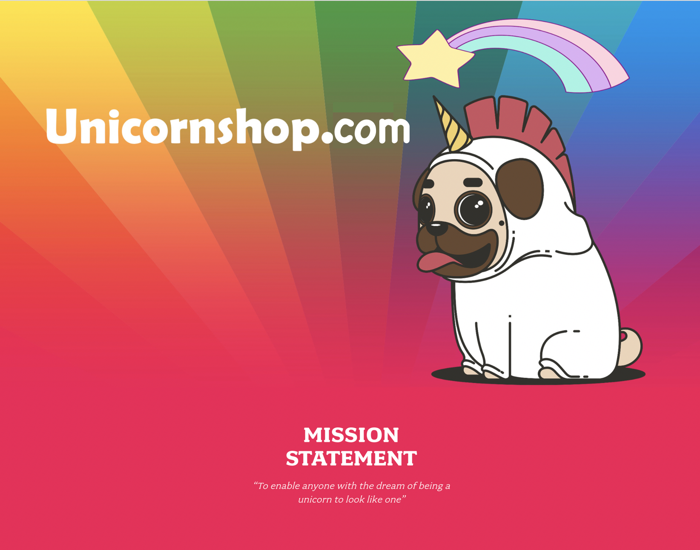

# Building A Real-Time Data Platform on AWS
### Q4 Learning Series Workshop

<h3>
Following a viral marketing campaign, an unprecedented surge of traffic led to a 12 hour outage of our Unicornshop online store. 
</h3>

After quickly increasing our capacity in our AWS environment, our CTO has mandated a better understanding of our infrastructure with a monitoring solution.

In addition, the VP of Sales and Marketing has decided on a new data strategy to win back customers through better understanding of how visitors behave across different channels.

Your mission, should you choose to accept it, is to create a real-time data platform to enable these outcomes for our unicorn business! 🦄🦄🦄 

